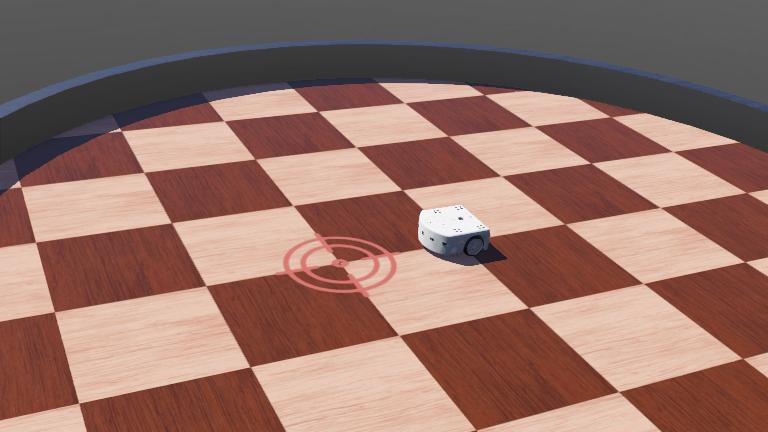

# Competition Organizer Template

[][1]

<!-- TODO: add examples when available
## Competition Examples

- <https://github.com/cyberbotics/robot-programming-competition-disabled>
- <https://github.com/cyberbotics/inverted-pendulum-competition-disabled>
-->
## Organizer Setup

To organize your own competition, follow the instructions in the [ORGANIZER.md](ORGANIZER.md) file.

---

## Description

Write here a short description of your competition.

## Information

- Difficulty: Middle School, High School, Bachelor, Master or PhD
- Robot: robot name
- Language: programming language of the controller template
- Commitment: amount of time needed to participate in the competition

---

## How to Participate

If not already done, [sign in](https://github.com/login) to your GitHub account or [create one](https://github.com/signup) if you don't have any.

### 1. Create your own Participant Repository from this Template

[Click here](../../generate) to create your own repository automatically or do it manually by clicking on the green button "Use this template". If you get a 404 page it's probably because you are not connected to your GitHub account.

- Fill the "Repository name" field with a name for your controller.
- Set the visibility of your repository to "Private" unless you don't care about people looking at your code.
- Finally, click on the green button "Create repository from template".

You should continue reading this document on your **own** repository page and not the one of the competition organizer. **This is important** in order to be able to use the links in the following sections. Remember that you can open a link in a new tab by middle-clicking the link.

### 2. Add the Organizer as a Collaborator

You can skip this step if you created your repository as "Public" instead of "Private".

Otherwise, you must grant access to your repository to the competition organizer so that your code can be checked out to evaluate its performance and the organizer can post issues on your repository in case of problems with your code.

- [Click here](../../settings/access) to go to the "Collaborators" setting page. You might need to confirm the access by re-entering your GitHub password.
- You should see a "Manage access" box where you will see the current collaborators of the repo.
Click on the "Add people" and search for "[ORGANIZER_USERNAME](https://github.com/ORGANIZER_USERNAME)".
When you found the organizer, add him to the repository.

### 3. Modify your Robot Controller

You can now edit your [participant.json](../../edit/main/controllers/participant/participant.json) file to set your name, description and country information and also modify your [main robot controller file](../../edit/main/controllers/participant/participant.py) or create new files in this folder and push the modification to the main branch of your repository.
A series of automated actions will take place in a few seconds.
If everything went well, your repository should appear after some time in the [leaderboard][1] of the competition.
If there was a problem, an [issue](../../issues) will be open automatically on your repository by the organizer.
You will have to read it, fix what is wrong and push the changes to your main branch to re-run the automated verification.

## Going Further

### Repository Structure

You repository contains many folders and files. However, you should make modifications only in [your robot controller directory](../../tree/main/controllers/participant), as only this directory is taken into consideration during the evaluation process, all the other files being taken from the competition organizer repository.

### Supervisor

The [supervisor controller](../../blob/main/controllers/supervisor/supervisor.py) is a special controller that evaluates the performance of your robot controller.
You should inspect its source code to understand more in detail how your controller will be evaluated.

### Webots

It is recommended to install [Webots R2023b or more recent](https://github.com/cyberbotics/webots/releases) (currently only available as a nightly build) on your computer and to checkout your repository.
This will allow you to work on the robot controller and test immediately your changes by running the world file in Webots.
Once you are satisfied with your changes, you can push them to GitHub to trigger the evaluation of the new version of your robot controller.

*Note:* if you push your changes on a branch which is not the default branch of your repository, no evaluation will be triggered.

### Docker

Your controller is evaluated in a [Docker container](https://www.docker.com/resources/what-container/). If your robot controller has dependencies, such as some specific libraries, python modules or a complete ROS framework, be sure to update the [controllers/Dockerfile](controllers/Dockerfile) to include all these dependencies. The default Webots Docker container includes the tools needed to run and compile simple C, C++ and Python controllers.

[1]: https://webots.cloud/run?version=R2023b&url=https%3A%2F%2Fgithub.com%2FORGANIZER_USERNAME%2FORGANIZER_REPOSITORY%2Fblob%2Fmain%2Fworlds%2Frobot_programming.wbt&type=competition "Leaderboard"
